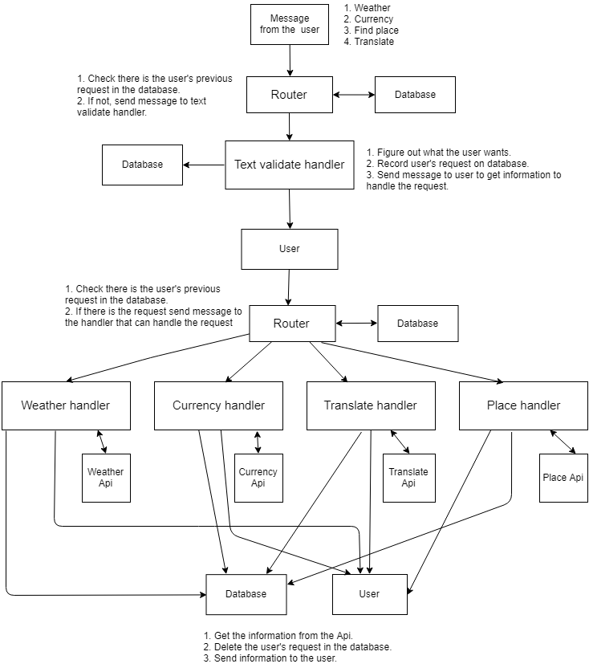
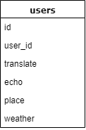
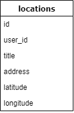

# Guide Bot

PHP 7.2.7, MariaDB 10.1.34

## What is it?

This bot is for guiding japanese who travel Korea using LINE App.
If a user send a message to the bot in LINE. It sends a information the user want to know to the user using several APIs.

It can handle 4 kinds of request from users.

1. **Weahter** - Select your location then the bot give you weatehr information of the place on today, tommorow, and the day after tommorw.
2. **Currency information** - From yen to won, won to yen.
3. **Translate** - The bot can translate from korean to japanese and japanese to korean.
4. **Place nearby** - Select your location and send keyword which you want to search nearby then the bot give results to you.

#### Which APIs it uses?

1. [LINE message API](https://developers.line.me/en/services/messaging-api/) (for chatbot)
2. [NAVER papago API](https://developers.naver.com/products/translator/) (for translating)
3. [Google map API](https://cloud.google.com/maps-platform/) (for searching places)
4. [Apilayer](https://apilayer.com/) (for currency)
5. [OpenWeatherMap](https://openweathermap.org/) (for weather)

### How I can use it?

#### Weather

1. Send "天気"(Weather) to bot.
1. You get the message that asks you location data.
1. Send your location data to bot.
1. You get weather data

#### Currency information

1. Send "為替"(Currency) to bot.
1. You get the currency information.

#### Translate

1. Send "翻訳"(translate) to bot.
1. Now you can use translator.
1. If you want to quit translator, send "終了"(quit) to bot.

#### Place nearby

1. Send "場所検索"(Search nearby) to bot.
1. You get the message that asks you location data.
1. Send your location data.
1. You get the message that asks you the keyword you want to find.
1. You get the place data nearby the location.

### Example

Add 'Guide bot' on your LINE app trough QRcode and send messages!
You have to send message in japanese so I let you know sevral japanese words that the bot understand

1. Weather - 天気
1. Currency - 為替
1. Search nearby - 場所検索
1. Translate - 翻訳

## Starting the application on your server

### Before do it, check [Officail LINE message API repo](https://github.com/line/line-bot-sdk-php) first.

1. First, download the repo.
1. Run **composer update** to use composer autoloader.
1. Open [.htaccess](.htaccess) file and enter configuration data.
1. Go to LINE channel setting page and set your webhook URL "YOUR_DOMAIN/public/index.php"
1. Import [guidebot.sql](guidebot.sql) file to your database
1. Finally, send a message to your chatbot!!

## How it works?

### Overview

1. A user sends a message to bot.
1. The bot parse the message and send to `router`.
1. `router` check there is the user's request in the database and if not it sends the message to `textvalidatehandler`
1. `Text validate handler` figures out what the user wants, records user's request on the database.
1. Bot sends reply message to user to get additional information to handle user's request.
1. The User sends reply to the request.
1. `router` check the users request in the database and
1. `hadnler` call the `API`.
1. From the `API`, `handler` gets the data and send it to the user and delete user's request in the database.
1. User gets the information!

### Database structure
#### users

#### locations

Save datas about location to handle user's weather, place request.

#### All handlers are based on the overview, but they each works a little different, if you wnat to know how they each works exactly check my code.

## Future works

1. Add logger for logging error or messages from the user.
2. Add error handler.
3. Bulid testing code.
